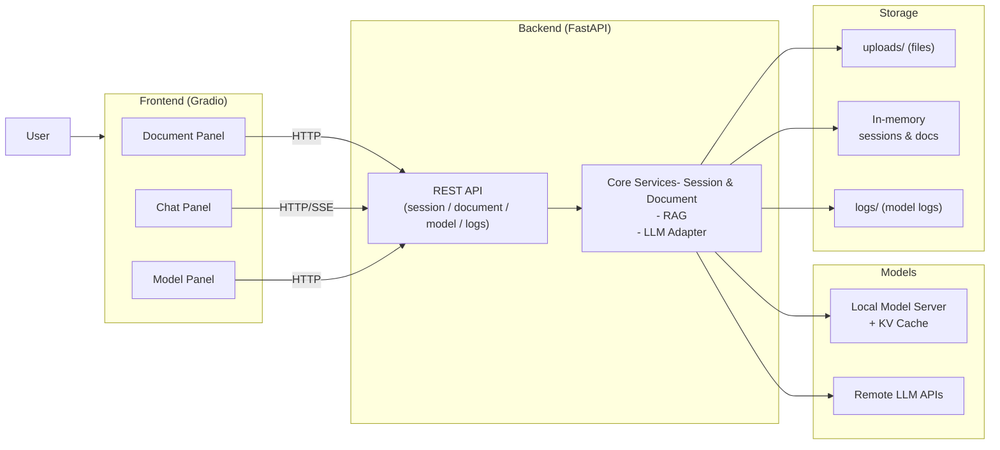
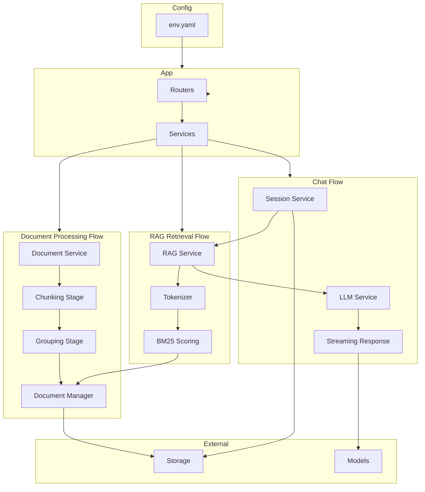

## KVCache Chatbot Overview

KVCache Chatbot is a document-augmented, multi-turn chatbot application with a clear separation between frontend and backend. It is designed to support both local and remote LLMs, provide efficient document-based question answering, and leverage KV cache optimization for better performance.

### Architecture Diagram

- **Frontend (`src/web`)**: Gradio-based web UI
  - Document upload and management
  - Document selection and cache control
  - Chat interface with streaming responses
  - Model management panel (start/stop/restart, status, logs)

- **Backend (`src/api`)**: FastAPI-based REST API
  - Session management for multi-turn conversations
  - Document upload, parsing, grouping, and RAG retrieval
  - Model management for local model server lifecycle
  - LLM integration via OpenAI-compatible APIs (OpenAI, Gemini, local servers, etc.)
  - KV cache pre-warming for document context

High-level flow:

1. The user uploads a document in the frontend.
2. The backend extracts and stores the document content (file in `uploads/`, metadata in memory).
3. When the user clicks "Cache", the backend sends a short prompt (document content wrapped in a system prompt) to the model to pre-populate the KV cache.
4. During chat, the user selects a document; the backend injects the document context into the system prompt and sends the conversation to the LLM service.
5. The LLM response is streamed back to the frontend.

---

## Architecture Highlights

### Backend Internal Structure

The backend follows a layered architecture with three main processing flows:

- **Document Processing Flow**: Documents are processed through chunking and grouping stages, then stored in the Document Manager
- **RAG Retrieval Flow**: RAG Service uses tokenization and BM25 scoring to retrieve relevant document groups from Document Manager
- **Chat Flow**: Session Service coordinates RAG retrieval, passes context to LLM Service, and streams responses back to clients

### Entry Point and Application Lifecycle

- **Main application (`src/api/main.py`)**
  - Creates the FastAPI application instance and mounts routers:
    - `session` – conversation sessions
    - `document` – document management and caching
    - `model` – local model server lifecycle and status
    - `logs` – model log retrieval
    - `upload` – legacy upload endpoints (kept for backward compatibility)
  - Defines an `async` lifespan context:
    - Ensures the upload directory (`settings.documents.upload_dir`) exists.
    - Starts a background cleanup task for expired sessions.
    - Creates a model log session and prints log file information for the model server.
    - Loads model configurations from `env.yaml` and initializes the global LLM service with the **first configured model**.
      - If no models are defined or the first model has no API key configured, startup fails with a clear error.
      - Completion parameters are merged (including any `custom_params`) and passed to the LLM service.
    - Logs the active model, base URL, and key completion parameters for transparency.
  - On shutdown:
    - Stops the session cleanup task.
    - If a local model server is running, gracefully shuts it down.

### Session Layer

- **Session service (`src/api/services/session_service.py`)**
  - `SessionManager` stores all conversation sessions in an in-memory dictionary.
  - Each `ConversationSession` includes:
    - `session_id`
    - message list
    - creation and last-activity timestamps
    - optional document content and filename (for legacy per-session document association)
  - A background task periodically removes expired sessions:
    - Timeout is configurable (default: 3600 seconds).
    - Cleanup runs every 5 minutes.
  - The service is intentionally designed to be replaceable with Redis/DB in the future.

### LLM Layer

- **LLM service (`src/api/services/llm_service.py`)**
  - Wraps an OpenAI-compatible `/chat/completions` API using `httpx.AsyncClient`.
  - Supports:
    - Streaming responses via SSE (`data: ...` and `[DONE]`).
    - Passing through all completion parameters (`temperature`, `max_tokens`, `top_p`, `repeat_penalty`, `chat_template_kwargs`, etc.) via a generic `completion_params` dictionary.
  - Global instance `llm_service`:
    - Configured on startup with the first model from `settings.all_models`.
    - Can be **reconfigured** at runtime (e.g., when switching models) without recreating the instance:
      - `reconfigure(model, api_key, base_url, **completion_params)`.
  - Auto-configuration safeguard:
    - If `api_key` is missing or `"empty"`, the service attempts to pick a valid model from `settings.all_models`.
    - If no suitable model can be found, it raises a clear runtime error instructing the user to configure `env.yaml`.
  - All API calls are logged through `model_log_service` (request metadata and response snippets) to improve observability.

### RAG (Retrieval-Augmented Generation) Layer

- **RAG service (`src/api/services/rag_service.py`)**
  - Implements a lightweight BM25-based retrieval mechanism instead of embedding-based similarity.
  - Uses a configurable tokenizer to support mixed English/Chinese text:
    - Attempts to use an advanced tokenizer (e.g., Jieba + OpenCC) when available.
    - Falls back to a simple regex-based tokenizer (English words, Chinese characters, numbers) otherwise.
  - Provides two main retrieval methods:
    - `retrieve_most_similar_group`:
      - Operates on **group-level** data (`group_id`, `merged_content`, `chunk_ids`, `total_tokens`).
      - Computes BM25 scores per group and returns the top-k groups.
    - `retrieve_by_chunk_with_group`:
      - Operates on **chunk-level** data first, then maps each top chunk back to its parent group.
      - Returns group-level content for the LLM plus chunk-level information for UI preview or highlighting.
  - Logs extensively:
    - Tokenization results, intermediate BM25 scores, rankings, and final selections.
    - This makes retrieval behavior transparent and easier to debug.

### KV Cache Mechanism

- **Design goals**
  - Use KV cache to accelerate repeated queries over the same document(s).
  - Ensure that cached prefixes exactly match the prompts used during normal chat, so the model can reuse previous key/value states.

- **Validation**
  - Before any cache operation (e.g., `POST /api/v1/documents/cache/{doc_id}`):
    - Verifies that the local model server is running.
    - Compares `llm_service.model` with `model_server.config.alias` to ensure the LLM service and model server are aligned.
    - Logs the current model name, base URL, and completion parameters.
  - If the model server is not running or configurations mismatch, the API returns an HTTP 503 with a descriptive error.

- **System prompt alignment**
  - A critical fix ensures that **both** cache operations and normal chat requests:
    - Use the same `system_prompt_template` from configuration.
    - Wrap the document content identically when building the system message.
  - This guarantees that the document prefix in the cache and the one used during chat are byte-identical, enabling effective prefix KV cache reuse.

- **Lifecycle**
  - KV cache is tied to the lifetime of the local model server process:
    - Populated when the user clicks "Cache" for a document.
    - Persists across sessions and requests while the model server is running.
    - Cleared when the model server is restarted with reset.

---

## Technology Stack and Key Characteristics

### Backend

- **Frameworks and libraries**
  - FastAPI – main web framework and API definition.
  - Pydantic – request/response models and validation.
  - Uvicorn – ASGI server for running the backend.
  - httpx – async HTTP client for LLM API calls and streaming.
  - PyYAML – loads `env.yaml` for model and server configuration.
  - aiofiles – asynchronous file I/O for document uploads.

- **Backend characteristics**
  - Clear separation between:
    - Routers (HTTP endpoints)
    - Services (session, document, LLM, model, RAG, logs)
    - External integrations (model server, file system, third-party APIs)
  - Designed to support both local and remote models through a unified configuration format in `env.yaml`.

### Frontend

- **Frameworks**
  - Gradio – web UI framework for building the chatbot interface.
  - httpx (or equivalent HTTP client) – communication with the backend API.

- **UI features**
  - Document upload area with validation.
  - Document list and selection dropdown with refresh.
  - Chat interface with streaming responses.
  - Model management controls and model status display.
  - Log viewing for model deployment and runtime behavior.

### Model Configuration and Management

- **Model definitions (`env.yaml`)**
  - Supports both:
    - `local_models` – models served by a local model server (e.g., llama.cpp).
    - `remote_models` – OpenAI-compatible APIs (OpenAI, Gemini, etc.).
  - Each model entry can include:
    - `serving_name`
    - `tokenizer`
    - `base_url`
    - `api_key`
    - `completion_params` (temperature, max_tokens, and arbitrary custom parameters)
    - `serving_params` for local server runtime options (e.g., `ctx_size`, `reasoning_format`, `n_gpu_layers`).

- **Runtime behavior**
  - On startup, the backend selects the first model from `settings.all_models` and configures `llm_service`.
  - When the user switches models (via model router/endpoints), the backend:
    - Reconfigures `llm_service` using `reconfigure`.
    - Starts/stops the local model server accordingly.
  - KV cache and cache validation logic always reference the currently active model configuration.

### Storage Strategy

- **In-memory**
  - Sessions:
    - Stored in `SessionManager._sessions`.
    - Include message history, timestamps, and (legacy) attached document information.
  - Documents:
    - Document metadata and preprocessed content are stored in a document manager (in memory).

- **File system**
  - Uploaded files are stored under an `uploads/` directory.
  - Model logs are written to log files under `src/api/logs/` with per-session log files for the model server.

- **Scalability considerations**
  - The current implementation is optimized for local or single-instance deployments:
    - In-memory storage is simple and fast but not distributed.
    - Single-process model server limits concurrent throughput.
  - The design and documentation anticipate future improvements, such as:
    - Redis or another external store for sessions.
    - Database for persistent document metadata.
    - Object storage (e.g., S3) for document files.
    - Horizontal scaling with multiple model server instances and load balancing.

